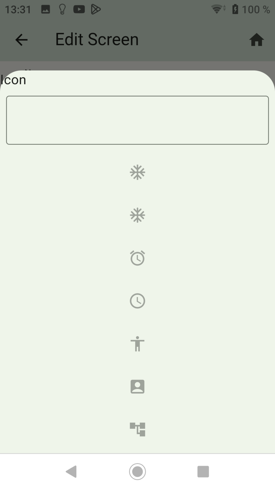
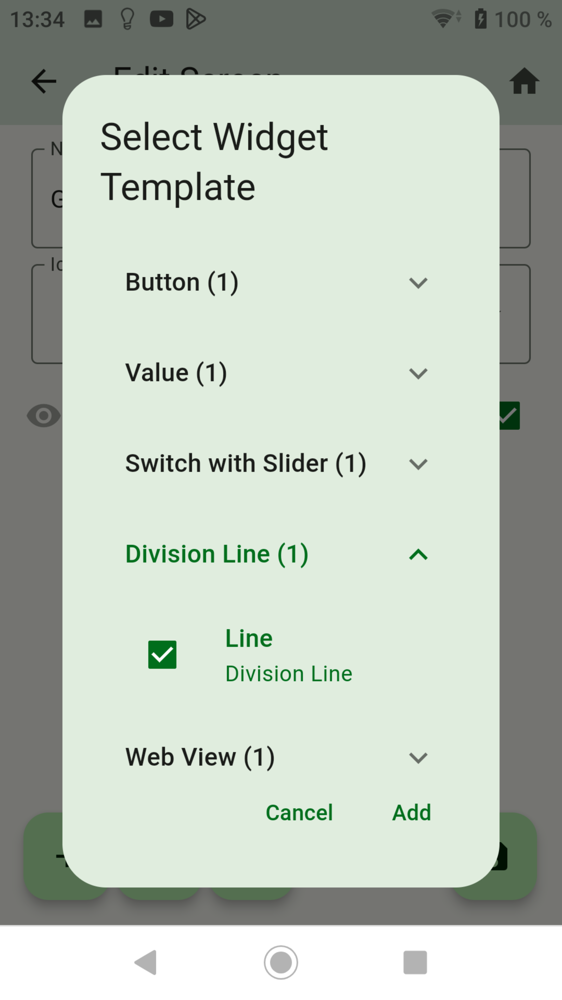
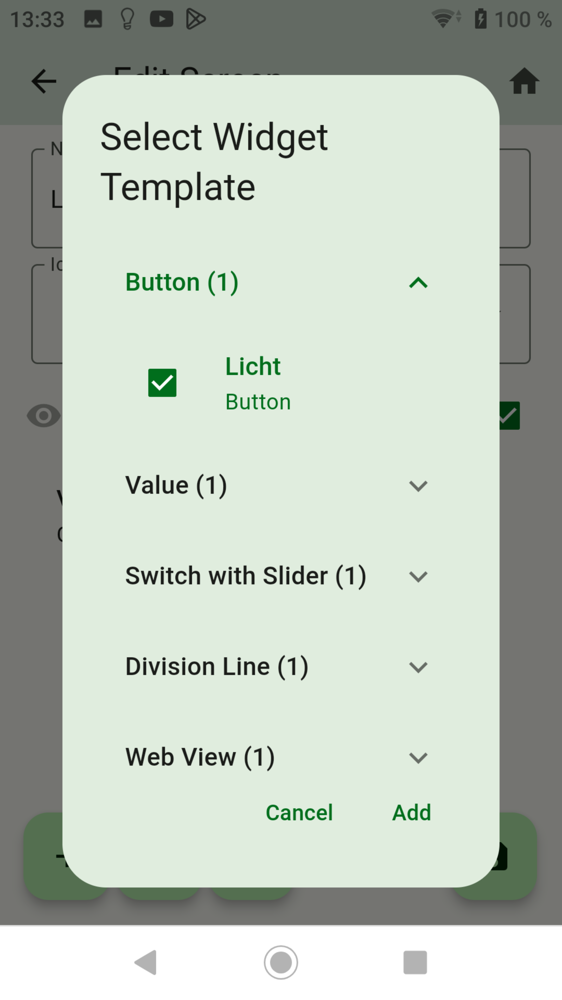
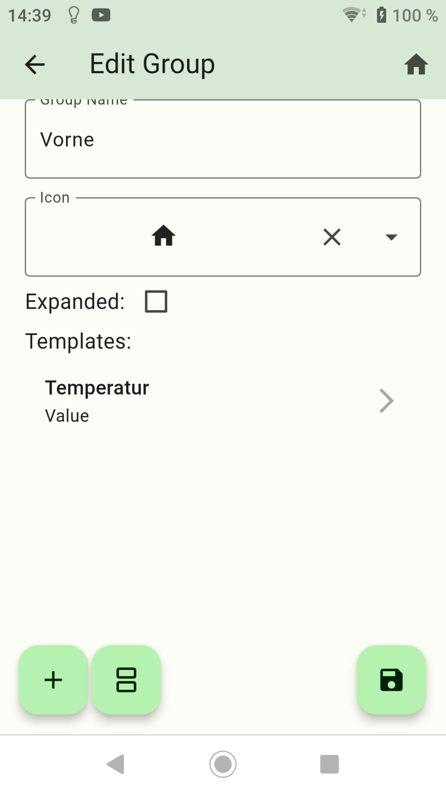
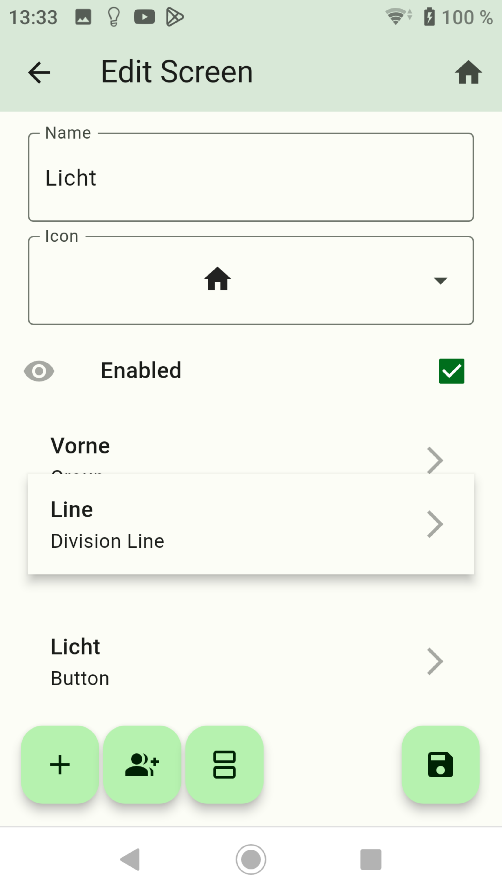
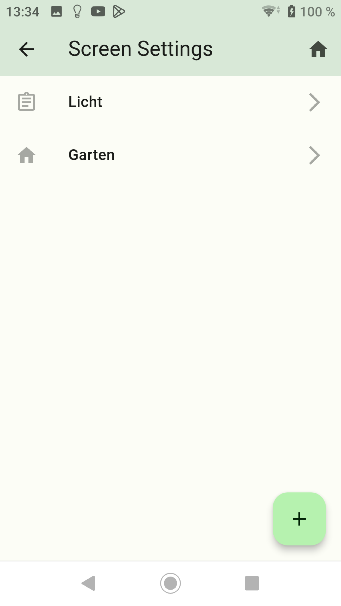
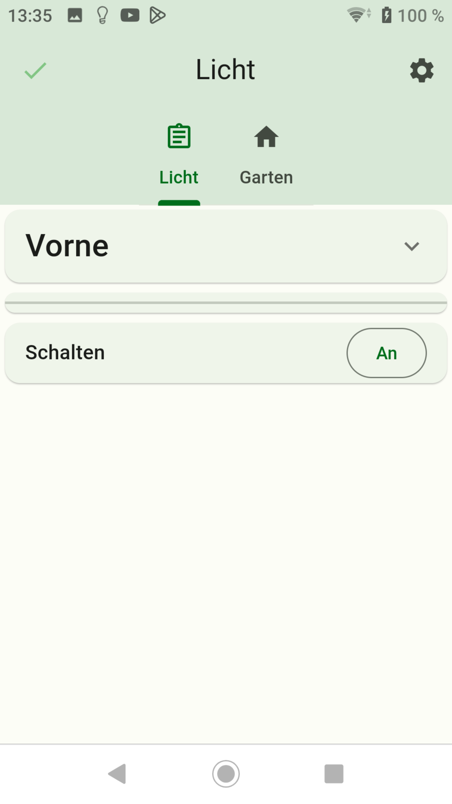

-   [Back to Summary](/docs/en/README.md)
-   [Step 1: Installation and APP setup](app.md)
-   [Step 2: Create Enums](enum.md)
-   [Step 3: Create Widgets](widgets.md)
-   [step 4: Create Screens](sreens.md)
-   [Step 5: Create Backups](backups.md)

## Create Screens `Screen Settings`

- Screens for the header can now be created here and widgets can be added to them. Widgets cannot be added twice in Sceerns.
- Swipe left to delete a screen. When the last screen is deleted, a new one called Template will automatically appear.

- Press the plus sign at the bottom right to create a new screen or click on 'Template' to change the name.

- Enter a name that should be displayed in the header and an icon can be selected. Then press save.

- In this screen you can create groups, add additional divisions and widgets.
- The screen can be deactivated/activated with the checkbox `Enabled`.
- By clicking on the bottom left cross, widgets are added. In this popup you can expand the categories and select them with a tick.

- A group can be created by clicking on the middle button.

- Widgets and divisions can now be added to this group.
- With `Expanded` you can determine whether the group is displayed open or closed.
- It is also possible to select an ICON.

- You can create division by pressing the 3rd button from the left. Of course, a division can also be created using a widget. Set the height and press the 'Add' button.

- By pressing and holding a widget the position can be changed.

- The created screens should now look like this.

- Now switch to the screen overview and press the house at the top right to display the screens.

-   [Back to Summary](/docs/en/README.md)
-   [Step 1: Installation and APP setup](app.md)
-   [Step 2: Create Enums](enum.md)
-   [Step 3: Create Widgets](widgets.md)
-   [step 4: Create Screens](sreens.md)
-   [Step 5: Create Backups](backups.md)